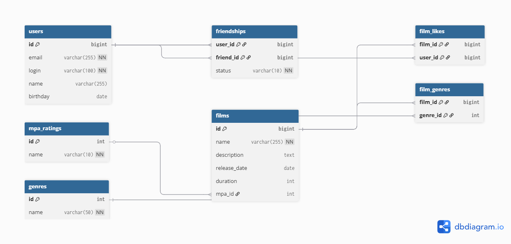

# java-filmorate
Template repository for Filmorate project.
# ER-Diagram

# Описание таблицы
- **mpa_ratings** – справочник рейтингов MPA (G, PG, PG-13, R, NC-17).
- **genres** – справочник жанров фильмов.
- **films** – основная таблица фильмов.
- **film_genres** – связь фильмов с жанрами (многие ко многим).
- **users** – пользователи приложения.
- **friendships** – связь дружбы между пользователями.
- **film_likes** – лайки фильмов от пользователей.
# Примеры запросов
```sql
-- Топ‑10 популярных фильмов (по количеству лайков)
SELECT f.id, f.name, COUNT(fl.user_id) AS likes_count
FROM films f
LEFT JOIN film_likes fl ON f.id = fl.film_id
GROUP BY f.id
ORDER BY likes_count DESC
LIMIT 10;

-- Список друзей пользователя (только подтверждённые) для user_id = 1
SELECT DISTINCT u.id, u.login, u.name
FROM (
    SELECT friend_id AS friend_id
    FROM friendships
    WHERE user_id = 1 AND status = 'CONFIRMED'
    UNION
    SELECT user_id AS friend_id
    FROM friendships
    WHERE friend_id = 1 AND status = 'CONFIRMED'
) AS friends
JOIN users u ON u.id = friends.friend_id;

-- Общие друзья двух пользователей (id = 1 и id = 2)
SELECT u.id, u.login, u.name
FROM (
    SELECT friend_id AS friend_id
    FROM friendships
    WHERE user_id = 1 AND status = 'CONFIRMED'
    UNION
    SELECT user_id
    FROM friendships
    WHERE friend_id = 1 AND status = 'CONFIRMED'
) f1
JOIN (
    SELECT friend_id AS friend_id
    FROM friendships
    WHERE user_id = 2 AND status = 'CONFIRMED'
    UNION
    SELECT user_id
    FROM friendships
    WHERE friend_id = 2 AND status = 'CONFIRMED'
) f2 ON f1.friend_id = f2.friend_id
JOIN users u ON u.id = f1.friend_id;

-- Неподтверждённые заявки в друзья для пользователя id = 1
SELECT u.id, u.login, u.name
FROM friendships f
JOIN users u ON f.user_id = u.id
WHERE f.friend_id = 1 AND f.status = 'PENDING';
